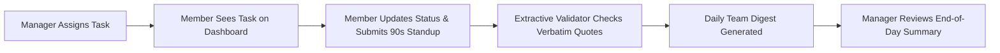

# Status Unblocked 🛡️
### Async Standup & Task Management Platform with Zero-Hallucination Digests

> **Status Unblocked** replaces time-consuming daily standup meetings with fast, asynchronous updates, direct task delegation, and 100% verifiable team digests. Every line in a digest links directly to the author's original words — no AI hallucinations, no lost blockers, and no micromanagement.

---

## 🎯 The Problem

**The brief** (*The Status-Update Tax*, [`projectstatement.txt`](projectstatement.txt)): on a distributed team, daily standups and status-chasing eat everyone's morning. Build a bot that collects short async updates from each member and summarises progress and blockers into one daily digest.

A standup call puts 6–10 people across timezones in one slot to hear eight updates, most of which don't matter to any given listener. The usual fix, "just post your update in the channel", swaps one tax for another: a wall of text nobody reads, and blockers typed into the void.

**Collecting updates is the easy part.** Three things are hard:

1. **Summarising faithfully.** Ten updates into one digest without inventing or distorting anything. If a summary says someone is "unblocked" when they aren't, the digest is worse than useless.
2. **Follow-through.** A blocker in a chat message has no owner and no status, and it scrolls away. Nothing knows on Wednesday that Monday's blocker is still open.
3. **Trust.** The moment a status tool feels like surveillance, people write defensive updates and the data stops being worth reading.

The brief names these as its three **enterprise-grade** requirements. Here is how each one is answered:

| Requirement | What we built |
| :--- | :--- |
| **"Make summaries faithful and link each blocker back to its source message."** | Every digest line is the author's exact words. A faithfulness validator checks every line against its stored source before the digest ships, and drops any line that fails. Each line links to an evidence page that highlights the quoted words. |
| **"Write structured output back to a task tracker."** | Each blocker becomes a GitHub issue with labels and a JSON block (who, the quote, first reported, days reported, links back). The same blocker on a later day adds a "Still blocked" comment instead of a duplicate issue. |
| **"Respect channel and privacy boundaries — don't become surveillance."** | The Teams bot reads only messages sent to it directly and requests no Microsoft Graph permissions. Every opening of someone's stored update is audited, and they can see who opened it on **My Data**. Old updates are deleted after the team's retention period. |

**Target:** about 90 seconds to write an update and 30 seconds to read the digest, instead of a 15-minute call.

---

## ⚡ Quickstart (Run in 30 Seconds)

You can run the entire stack locally with one command:

### 1. Clone & Install Dependencies

```bash
git clone https://github.com/RitGos28/status-unblocked.git
cd status-unblocked

# Setup Backend Environment
cd backend
python3 -m venv .venv
source .venv/bin/activate
pip install -e ".[dev]"
cd ..

# Setup Frontend Dependencies
cd frontend
npm install
cd ..
```

### 2. Start Both Backend & Frontend

```bash
./run.sh all
```

- 🌐 **Web App (React)**: [http://localhost:5173](http://localhost:5173)
- ⚙️ **Backend API (FastAPI)**: [http://localhost:8000](http://localhost:8000)
- 📖 **Interactive API Docs**: [http://localhost:8000/docs](http://localhost:8000/docs)

*(Alternatively, run just the backend with `./run.sh backend` or just the frontend with `./run.sh frontend`)*

---

## 🔑 Demo Credentials

Status Unblocked is designed to be frictionless — no complicated sign-up forms or email confirmations.

### Team Member Login
Sign in with your team's code and your name. Each team's code is generated when the demo data is seeded, so every install has its own. The seed prints them, and you can print them again at any time:

```bash
cd backend && python -m scripts.team_codes             # local
docker compose exec api python -m scripts.team_codes   # Docker
```

The seed creates two teams of made-up updates, each person planted to show off a feature:

| Team | Member | What their updates demonstrate |
| :--- | :--- | :--- |
| **Core Platform** | `Ritwik Gossain` | The same blocker on two days: listed as **Still Blocked** citing both days, and one GitHub issue with a follow-up comment |
| | `Madhav Kumar` | "Not blocked." and "No blockers today." are correctly *not* counted as blockers |
| | `Shresth Tiwari` | A blocker typed under Progress ("Stuck on the deploy pipeline.") is moved to Blockers, with a note saying why |
| **Mobile** | `Vikram Malhotra` | A second team: Core Platform's pages answer 404 for them, and the reverse |

### Manager Portal Login
To prevent regular team members from accessing managerial controls, the manager portal is protected with dedicated credentials:

| Field | Default Value | Notes |
| :--- | :--- | :--- |
| **User ID** | `manager` | Configurable via `STANDUP_MANAGER_USERNAME` |
| **Password** | `status2026` | Configurable via `STANDUP_MANAGER_PASSWORD` |

> ⚠️ These defaults are public (they are in this README), so they are for a local demo only. Anywhere other people can reach, set `STANDUP_MANAGER_PASSWORD` to your own value, in `backend/.env` or, for Docker, in the `.env` next to `docker-compose.yml`.

---

## ✨ Key Features

### 1. 📋 Member Assigned Tasks Dashboard
- **Direct Task Visibility**: When a manager assigns work to a team member (e.g., *Divyam Manas*), that task immediately appears on their home dashboard.
- **Interactive Status Updates**: Members can change task states on the fly (`Pending` ➔ `In Progress` ➔ `Completed` ➔ `Blocked`).
- **One-Click Standup Integration**: On the update submission form, active assigned tasks appear as helper chips. Click any task to instantly insert it into today's progress or plan!

### 2. 🛡️ Protected Manager Portal
- **Role Isolation**: Only authenticated managers can assign tasks, add members, or view project summaries.
- **Task Delegation**: Create tasks with titles, detailed descriptions, assignees, priorities (`Urgent`, `High`, `Medium`, `Low`), and due dates.
- **Team Management**: Add new team members dynamically — they appear immediately on the team directory and assignment dropdowns.
- **End-of-Day Project Summary**: Generate instant daily or project summaries analyzing completion rates, in-progress items, blockers, and individual member breakdowns.
- **Sync Team Codes**: Customize or regenerate team codes to easily sync local environments with deployed sites.

### 3. 🔍 Zero-Hallucination Extractive Digests
- **Verbatim Citations**: Unlike generative AI tools that hallucinate ~15% of facts, our summarizer uses extractive synthesis. Every line in a team digest is a verbatim quote verified against stored sources.
- **Evidence Inspection**: Click on any claim in a digest to open its evidence page, highlighting the author's exact words with character-level precision.
- **Intelligent Blocker Promotion**: Blockers mentioned anywhere (even accidentally under "Progress") are automatically highlighted and tracked. If a blocker persists over multiple days, it is tagged as **Still Blocked**.

### 4. 🔒 Privacy & Audit Transparency
- **No Micromanagement Surveillance**: No keystroke logging, no activity tracking, and no employee productivity scores.
- **Audit Logging**: Stored updates are strictly protected. If an evidence page is viewed, an audit log records the view, and the author can inspect access history on their **My Data** page.
- **Data Retention Policies**: Automated cleanup purges expired historical records while preserving verified digest records.

---

## 🎬 Demo Walkthrough

[`docs/DEMO.md`](docs/DEMO.md) walks through every demoable feature step by step, with no accounts needed: a local fake GitHub and a fake Teams connector stand in for the real services. `backend/scripts/demo_check.sh` runs that walkthrough against a real server and checks every step (29 of them); CI runs it on every change.

### How the faithfulness validator works

Every digest line must pass these rules before it ships. A line that fails is withheld, never published:

| Rule | Checks that… |
| :--- | :--- |
| **V1** | the line cites at least one source |
| **V2** | every cited source exists in that day's updates |
| **V3** | the quoted words are exactly the source's words at the recorded position |
| **V4** | every number in the line appears in a cited quote |
| **V5** | every issue number, link or @handle in the line appears in a cited quote |
| **V6** | the line is credited to the person who wrote the source |
| **V7** | no source outside what its author consented to share (**not built yet**) |
| **V8** | a line written in its own words (not a quote) isn't padded far beyond its sources |
| **V9** | the line's text *is* its quote, not a paraphrase |
| **V10** | the line sits in the section its source belongs to (a blocker can't be hidden under Progress) |

`python -m scripts.faithfulness_demo` shows it at work: the real lines pass, and seven deliberately unfaithful claims are each withheld, naming the rule that caught them.

### Not built yet

- An AI (LLM) summarizer. The summarizer today is rule-based and extractive; any future model would have to pass the same validator.
- Consent before sending data to an outside service (rule V7), and redaction of secrets.
- Members deleting their own data, and contesting or correcting a digest line.
- Syncing GitHub issue state (closed, assigned) back into the digest.
- A written legitimate-interest assessment (`docs/LIA.md`).

**Microsoft Teams:** the bot is built on Microsoft's official Agents SDK, but it has only been tested against a local stand-in for Teams and hand-written messages, never a real Teams tenant. **GitHub:** blockers go to a local stand-in by default; pointing them at real GitHub needs a token and a repository.

---

## 🔄 Daily Workflow



1. **Morning**: Team members check their dashboard to view assigned tasks and priorities.
2. **Throughout the Day**: Members update task statuses as they progress (`In Progress`, `Completed`, `Blocked`).
3. **End of Day**: Members spend ~90 seconds answering three simple questions:
   - *Progress*: What moved forward?
   - *Blockers*: What is stopping you?
   - *Plan*: What are you picking up next?
4. **Digest Publication**: The system generates a clean, verified daily digest for the team.
5. **Manager Review**: The manager inspects the daily summary and reallocates resources or assists with blockers.

---

## 📂 Project Structure

```
status-unblocked/
├── backend/                  # FastAPI Backend (Python 3.13)
│   ├── src/standup/
│   │   ├── api/              # REST API endpoints (tasks, auth, digests, manager)
│   │   ├── auth/             # Team code generation & session auth
│   │   ├── db/               # SQLAlchemy models & Alembic migrations
│   │   ├── summarize/        # Zero-hallucination extractive engine & validator
│   │   └── ingestion/        # Webform & Teams bot ingestion adapters
│   └── tests/                # Comprehensive unit & integration test suite (372 tests)
│
├── frontend/                 # Modern React Frontend (Vite + JSX)
│   ├── src/
│   │   ├── pages/            # Home, Submit, Digests, Evidence, Manager, Team, Login
│   │   ├── components/       # Layout, Header, task lists, notice cards
│   │   ├── context/          # Client-side AuthContext
│   │   └── api/              # API client methods
│   └── package.json
│
├── docker-compose.yml        # Docker deployment configuration
└── run.sh                    # Unified startup script (backend / frontend / all)
```

---

## 🧪 Testing & Code Quality

Run tests and linters across the project:

### Backend Tests
```bash
cd backend
.venv/bin/pytest                     # Runs full test suite (372 tests)
.venv/bin/ruff check .               # Linting checks
.venv/bin/mypy src                   # Strict static type checking
```

### Frontend Build Verification
```bash
cd frontend
npm run build                        # Production bundle verification
```

---

## 🐳 Docker Deployment

To run the entire system in Docker with PostgreSQL:

```bash
docker compose up --build
```

The app will be available at `http://localhost:3000` (React frontend) and `http://localhost:8000` (FastAPI backend).

---

## 📄 License & Contributing

Status Unblocked is open-source under the MIT License. Contributions, issues, and feature requests are welcome!
