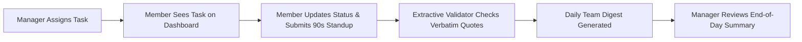

# Status Unblocked 🛡️
### Async Standup & Task Management Platform with Zero-Hallucination Digests

> **Status Unblocked** replaces time-consuming daily standup meetings with fast, asynchronous updates, direct task delegation, and 100% verifiable team digests. Every line in a digest links directly to the author's original words — no AI hallucinations, no lost blockers, and no micromanagement.

---

## ⚡ Quickstart (Run in 30 Seconds)

You can run the entire stack locally with one command:

### 1. Clone & Install Dependencies

```bash
git clone https://github.com/RitGos28/status-unblocked.git
cd status-unblocked

# Setup Backend Environment
cd backend
python3 -m venv .venv
source .venv/bin/activate
pip install -e ".[dev]"
cd ..

# Setup Frontend Dependencies
cd frontend
npm install
cd ..
```

### 2. Start Both Backend & Frontend

```bash
./run.sh all
```

- 🌐 **Web App (React)**: [http://localhost:5173](http://localhost:5173)
- ⚙️ **Backend API (FastAPI)**: [http://localhost:8000](http://localhost:8000)
- 📖 **Interactive API Docs**: [http://localhost:8000/docs](http://localhost:8000/docs)

*(Alternatively, run just the backend with `./run.sh backend` or just the frontend with `./run.sh frontend`)*

---

## 🔑 Demo Credentials

Status Unblocked is designed to be frictionless — no complicated sign-up forms or email confirmations:

### Team Member Login
Sign in with your team's code and your name:

| Team | Team Code | Demo Members |
| :--- | :--- | :--- |
| **Core Platform** | `CORE-AR9WS` | `Divyam Manas`, `Aarav Sharma`, `Ananya Patel`, `Rohan Verma`, `Pooja Hegde` |
| **Mobile Team** | `MOBI-EFSHY` | `Vikram Malhotra` |

### Manager Portal Login
To prevent regular team members from accessing managerial controls, the manager portal is protected with dedicated credentials:

| Field | Default Value | Notes |
| :--- | :--- | :--- |
| **User ID** | `manager` | Configurable via `STANDUP_MANAGER_USERNAME` |
| **Password** | `status2026` | Configurable via `STANDUP_MANAGER_PASSWORD` |

---

## ✨ Key Features

### 1. 📋 Member Assigned Tasks Dashboard
- **Direct Task Visibility**: When a manager assigns work to a team member (e.g., *Divyam Manas*), that task immediately appears on their home dashboard.
- **Interactive Status Updates**: Members can change task states on the fly (`Pending` ➔ `In Progress` ➔ `Completed` ➔ `Blocked`).
- **One-Click Standup Integration**: On the update submission form, active assigned tasks appear as helper chips. Click any task to instantly insert it into today's progress or plan!

### 2. 🛡️ Protected Manager Portal
- **Role Isolation**: Only authenticated managers can assign tasks, add members, or view project summaries.
- **Task Delegation**: Create tasks with titles, detailed descriptions, assignees, priorities (`Urgent`, `High`, `Medium`, `Low`), and due dates.
- **Team Management**: Add new team members dynamically — they appear immediately on the team directory and assignment dropdowns.
- **End-of-Day Project Summary**: Generate instant daily or project summaries analyzing completion rates, in-progress items, blockers, and individual member breakdowns.
- **Sync Team Codes**: Customize or regenerate team codes to easily sync local environments with deployed sites.

### 3. 🔍 Zero-Hallucination Extractive Digests
- **Verbatim Citations**: Unlike generative AI tools that hallucinate ~15% of facts, our summarizer uses extractive synthesis. Every line in a team digest is a verbatim quote verified against stored sources.
- **Evidence Inspection**: Click on any claim in a digest to open its evidence page, highlighting the author's exact words with character-level precision.
- **Intelligent Blocker Promotion**: Blockers mentioned anywhere (even accidentally under "Progress") are automatically highlighted and tracked. If a blocker persists over multiple days, it is tagged as **Still Blocked**.

### 4. 🔒 Privacy & Audit Transparency
- **No Micromanagement Surveillance**: No keystroke logging, no activity tracking, and no employee productivity scores.
- **Audit Logging**: Stored updates are strictly protected. If an evidence page is viewed, an audit log records the view, and the author can inspect access history on their **My Data** page.
- **Data Retention Policies**: Automated cleanup purges expired historical records while preserving verified digest records.

---

## 🔄 Daily Workflow



1. **Morning**: Team members check their dashboard to view assigned tasks and priorities.
2. **Throughout the Day**: Members update task statuses as they progress (`In Progress`, `Completed`, `Blocked`).
3. **End of Day**: Members spend ~90 seconds answering three simple questions:
   - *Progress*: What moved forward?
   - *Blockers*: What is stopping you?
   - *Plan*: What are you picking up next?
4. **Digest Publication**: The system generates a clean, verified daily digest for the team.
5. **Manager Review**: The manager inspects the daily summary and reallocates resources or assists with blockers.

---

## 📂 Project Structure

```
status-unblocked/
├── backend/                  # FastAPI Backend (Python 3.13)
│   ├── src/standup/
│   │   ├── api/              # REST API endpoints (tasks, auth, digests, manager)
│   │   ├── auth/             # Team code generation & session auth
│   │   ├── db/               # SQLAlchemy models & Alembic migrations
│   │   ├── summarize/        # Zero-hallucination extractive engine & validator
│   │   └── ingestion/        # Webform & Teams bot ingestion adapters
│   └── tests/                # Comprehensive unit & integration test suite (370+ tests)
│
├── frontend/                 # Modern React Frontend (Vite + JSX)
│   ├── src/
│   │   ├── pages/            # Home, Submit, Digests, Evidence, Manager, Team, Login
│   │   ├── components/       # Layout, Header, task lists, notice cards
│   │   ├── context/          # Client-side AuthContext
│   │   └── api/              # API client methods
│   └── package.json
│
├── docker-compose.yml        # Docker deployment configuration
└── run.sh                    # Unified startup script (backend / frontend / all)
```

---

## 🧪 Testing & Code Quality

Run tests and linters across the project:

### Backend Tests
```bash
cd backend
.venv/bin/pytest                     # Runs full test suite (370+ tests passing)
.venv/bin/ruff check .               # Linting checks
.venv/bin/mypy src                   # Strict static type checking
```

### Frontend Build Verification
```bash
cd frontend
npm run build                        # Production bundle verification
```

---

## 🐳 Docker Deployment

To run the entire system in Docker with PostgreSQL:

```bash
docker compose up --build
```

The app will be available at `http://localhost:3000` (React frontend) and `http://localhost:8000` (FastAPI backend).

---

## 📄 License & Contributing

Status Unblocked is open-source under the MIT License. Contributions, issues, and feature requests are welcome!
